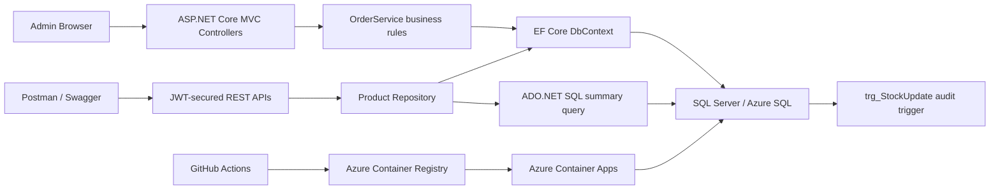

# Retail Optimization Platform

ASP.NET Core MVC inventory and order management platform for a retail operations dashboard. The project demonstrates MVC/Razor UI, EF Core and SQL Server data access, REST APIs secured with JWT/cookie authorization, unit testing, Docker, GitHub Actions, and Azure Container Apps deployment.

## Demo Login

The dashboard is admin-only. Unauthenticated users are redirected to `/Account/Login`.

Local development credentials:

```text
Email: admin@retail.local
Password: Admin@12345
```

For Azure/production, prefer Container App environment variables instead of hard-coding credentials:

```text
Admin__Email=<admin email>
Admin__Password=<strong password>
ConnectionStrings__DefaultConnection=<Azure SQL connection string>
Jwt__Key=<strong JWT signing key>
Jwt__Issuer=RetailOptimizationPlatform
Jwt__Audience=RetailOptimizationUsers
Jwt__ExpiryMinutes=60
```

## Architecture



## Rubric Mapping

| Criteria | Points | Evidence in this repo |
| --- | ---: | --- |
| Backend and MVC | 25 | MVC controllers, Razor views, protected Razor Page summary, TagHelpers, admin-only routing, model validation attributes, service/repository layering, custom exceptions. |
| Database and Data Access | 20 | EF Core migrations, normalized `Products`, `Orders`, `OrderItems`, `AppUsers`, `StockAuditLogs`; repository pattern; ADO.NET sales summary join; SQL trigger migration. |
| Web API and Security | 15 | REST endpoints under `/api/inventory` and `/api/ai`; JWT bearer support; cookie login for dashboard; role-based `Admin` authorization; anti-forgery on MVC POST forms. |
| Testing and Code Quality | 10 | xUnit tests for order business rules and product repository behavior; custom exception types; CI test workflow runs the real test project. |
| Cloud, DevOps and AI | 10 | Dockerfile, docker-compose, GitHub Actions CI, Azure Container Apps deployment workflow, ACR image push, conceptual AI reorder summarizer endpoint, Copilot prompt log. |
| Analytical Thinking | 10 | Inventory KPIs, low-stock analysis, reorder thresholds, stock-value metrics, order trend chart, stock audit history design. |
| Documentation and Presentation | 10 | README setup, architecture diagram, rubric mapping, demo checklist, SQL script, Copilot prompt evidence in `docs/copilot_prompts.txt`. |

## Key Features

- Admin login gate before dashboard access.
- Inventory dashboard with KPI cards, category chart, stock vs reorder chart, product catalog, and an admin-only Razor Page rubric summary.
- Product create, edit, delete, low-stock listing, and live stock verification.
- Customer order placement that validates stock, deducts inventory, calculates totals, and records order items in one transaction.
- EF Core migrations that apply automatically at startup, including the stock audit trigger.
- REST APIs protected for Admin users through JWT bearer or authenticated admin cookie.
- Developer-only JWT endpoint for Postman testing in Development.

## Local Run

### Option 1: Visual Studio / dotnet CLI with local SQL container

```powershell
docker compose up -d sqlserver
dotnet restore RetailOptimizationPlatform.csproj
dotnet ef database update
dotnet run --project RetailOptimizationPlatform.csproj
```

Open the displayed local URL and sign in with the admin credentials above.

### Option 2: Full Docker Compose

```powershell
docker compose up --build
```

Open:

```text
http://localhost:8080
```

## API Testing With Postman

Get a development JWT token:

```http
POST http://localhost:8080/api/auth/dev-token
Content-Type: application/json

{
  "email": "admin@retail.local",
  "role": "Admin"
}
```

Postman test script:

```javascript
pm.test("Token received", function () {
  pm.response.to.have.status(200);
  const json = pm.response.json();
  pm.expect(json.token).to.be.a("string").and.not.empty;
  pm.environment.set("jwt_token", json.token);
});
```

Use the token on secured API requests:

```text
Authorization: Bearer {{jwt_token}}
```

Example endpoints:

```http
GET http://localhost:8080/api/inventory/low-stock
GET http://localhost:8080/api/inventory/dashboard-data
GET http://localhost:8080/api/inventory/check/1
GET http://localhost:8080/api/ai/summarize-reorder/1
```

## Testing

Run the same test project that CI executes:

```powershell
dotnet test RetailOptimizationPlatform.Tests\RetailOptimizationPlatform.Tests.csproj --configuration Release --verbosity normal
```

Current verified result: 6 tests passed.

## GitHub Actions

### CI workflow

`.github/workflows/ci-cd.yml` runs on pushes and pull requests to `main`/`master`:

- Restore application and test projects.
- Build the ASP.NET Core app.
- Run `RetailOptimizationPlatform.Tests`.
- Build and publish a Docker image to GitHub Container Registry on default branch pushes.

### Azure deployment workflow

`.github/workflows/deploy-azure-webapp.yml` runs on pushes to `main` or manual dispatch:

- Logs in to Azure with `AZURE_CREDENTIALS`.
- Validates required deployment secrets.
- Logs in to ACR.
- Builds and pushes the Docker image.
- Updates the Azure Container App to the new image.

Required GitHub repository secrets:

```text
AZURE_CREDENTIALS
ACR_NAME
AZURE_RESOURCE_GROUP
AZURE_CONTAINERAPP_NAME
```

Recommended Azure Container App environment variables:

```text
ConnectionStrings__DefaultConnection
Jwt__Key
Jwt__Issuer
Jwt__Audience
Jwt__ExpiryMinutes
Admin__Email
Admin__Password
ASPNETCORE_ENVIRONMENT=Production
```

## Azure Notes

The app calls `dbContext.Database.Migrate()` on startup, so Azure applies EF migrations when the new container starts. This avoids GitHub-hosted runner firewall issues with Azure SQL. Make sure the Container App can reach Azure SQL and the SQL connection string is set in Container App environment variables.

## Demo Checklist

1. Open the app and confirm it redirects to `/Account/Login`.
2. Sign in as the admin user.
3. Show dashboard KPIs and charts.
4. Add or edit a product.
5. Place an order and verify stock is deducted.
6. Call a secured API in Postman with the JWT token.
7. Show GitHub Actions CI/CD history.
8. Show Azure Container App, Azure SQL database, and ACR resources in the portal.
9. Mention `docs/copilot_prompts.txt` as the AI/Copilot process artifact.